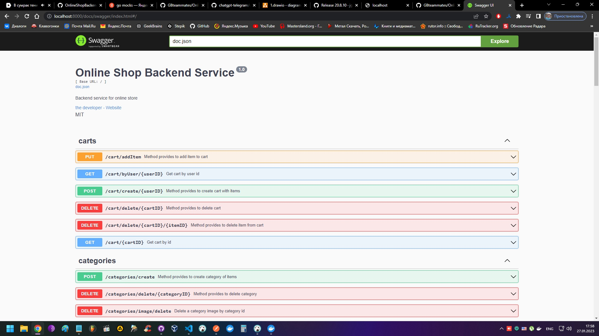

## Описание

Бэкенд сервис для небольшого онлайн магазина, написанный на языке программирования Golang.
Проект представляет собой MVP в виде монолита. Функциоанльность реализована в виде REST API. В связи с простотой и распространенностью, широким функционалом, а также потому что большинство контрибуторов уже ранее работали с ним, в качестве роутера был выбран gin-gonic/gin. В будущем при увеличении нагрузки возможен переход на более производительные роутеры, например fasthttp. По тем же причинам в качестве основной СУБД для хранения данных сервиса была выбрана реляционная СУБД Postgresql. В текущей реализации возможностей данной СУБД достаточно, большинство контрибуторов знакомы с этой базой данных, что позволило ускорить процесс разработки. Для увеличения отзывчивости сервиса реализован кэш на основе key-value базы данных Redis. Кэш используется в наиболее частых и тяжелых операциях - таких как выведение списка категорий и товаров. Для логирования командой был выбран логгер zap за его широкий функционал, высокую скорость работы и понятную документацию. Для мониторинга сервиса используется связка из контейнеров prometheus для сбора метрик и grafana для их отображения. При разработке сервиса по возможности применялись принципы чистой архитектуры. Реализованы юнит тесты для большинства систем и интеграционные тесты базы данных.

## Функционал

### Для пользователей без прав администратора, в том числе не вошедших в систему:

- Создание/регистрация нового пользователя (эндпоинт `/user/create`, метод POST)
- Вход в систему уже существующего пользователя (эндпоинт `/user/login`, метод POST)
- Вход в систему с помощью учетной записи Google (эндпоинт `/user/login/google`, метод GET)
- Выход из системы (эндпоинт `/user/logout`, метод GET)
- Просмотр списка всех товаров (эндпоинт `/items/list`, метод GET), в том числе с возможностью задать ограничения по оффсету, лимиту, и параметры для сортировки (есть возможность сортировки по имени и по цене, по возрастанию и по убыванию, для этого эндпоинт дополняется парметрами вида: `/items/list/?offset=0&limit=10&sortType=name&sortOrder=asc`)
- Просмотр списка всех категорий товаров (эндпоинт `categories/list`, метод GET)
- Просмотр информации о товаре (эндпоинт `items/{itemID}`, метод GET)
- Просмотр информации о категории товаров (эндпоинт `categories/{categoryID}, метод GET)
- Просмотр списка товаров в определенной категории (эндпоинт `/items/?param=categoryName&offset=20&limit=10&sort_type=name&sort_order=asc`, также с возможностью сортировки и ограничения по количеству (sort_type == name or price, sort_order == asc or desc), метод GET)
- Поиск нужного товара (эндпоинт `/items/?param=searchRequest&offset=20&limit=10&sort_type=name&sort_order=asc`, также с возможностью сортировки и ограничения по количеству (sort_type == name or price, sort_order == asc or desc), метод GET)
- Просмотр информации об общем количестве товаров (эндпоинт `/items/quantity`, метод GET)
- Просмотр информации о количестве товаров в определенной категории (эндпоинт `/items/quantityCat/{categoryName}`, метод GET)

### Для вошедших в систему пользователей, не обладающих правами администратора:

- Просмотр профиля пользователя (эндпоинт `/user/profile`, метод GET)
- Изменение информации в профиле пользователя (эндпоинт `/user/profile/edit`, метод PUT)
- Добавление товара в список избранного (эндпоинт `/items/addFav/{userID}/{itemID}`, метод POST)
- Просмотр товаров из списка избранного (эндпоинт `/items/favList?param=userIDt&offset=20&limit=10&sort_type=name&sort_order=asc` (sort_type == name or price, sort_order == asc or desc), метод GET)
- Удаление товара из списка избранного (эндпоинт `/items/deleteFav/{userID}/{itemID}`, метод DELETE)
- Корзина создается при входе пользователя в систему, однако, есть возможность вручную создать корзину (эндпоинт `/cart/create/{userID}`, метод POST)
- Добавление товара в корзину (эндпоинт `/cart/addItem` метод PUT)
- Удаление товара из корзины (эндпоинт `/cart/delete/{cartID}/{itemID}`, метод DELETE)
- Просмотр корзины по идентификатору корзины (эндпоинт `/cart/{cartID}`, метод GET)
- Просмотр корзины по идентификатору пользователя (эндпоинт `/cart/byUser/{userID}`, метод GET)
- Удаление корзины (эндпоинт `/cart/delete/{cartID}`, метод DELETE)
- Создание заказа (эндпоинт `/order/create`, метод POST)
- Просмотр информации о заказе (эндпоинт `/order/{orderID}`, метод GET)
- Просмотр информации о заказах пользователя (эндпоинт `/order/list/{userID}`, метод GET)
- Изменение адреса доставки в заказе (эндпоинт `/order/changeaddress`, метод PATCH)

### Для пользователей, вошедших в систему с правами администратора:

- Смена роли (прав) пользователя (эндпоинт `/user/role/update`, метод PUT)
- Создание новой роли (прав) (эндпоинт `/user/createRights`, метод POST)
- Просмотр списка ролей (прав) (эндпоинт `/user/rights/list`, метод GET)
- Создание новой категории товаров (эндпоинт `/categories/create`, метод POST)
- Изменение существующей категории товаров (эндпоинт `/categories/{categoryID}`, метод PUT)
- Добавление изображения к существующей категории (эндпоинт `/categories/image/upload/{categoryID}`, метод POST)
- Удаление изображения у категории (эндпоинт `/categories/image/delete`, метод  DELETE)
- Удаление категории (эндпоинт `/categories/delete/{categoryID}`, метод DELETE)
- Создание нового товара (эндпоинт `/items/create`, метод POST)
- Изменение существующего товара (эндпоинт `/items/update`, метод PUT)
- Добавление изображения к существующему товару (эндпоинт `/items/image/upload/:itemID`, метод POST)
- Удаление изображения товара (эндпоинт `/items/image/delete?id=25f32441-587a-452d-af8c-b3876ae29d45&name=20221209194557.jpeg`, метод DELETE)
- Удаление товара (эндпоинт `/items/delete/{itemID}`, метод DELETE)
- Удаление заказа (эндпоинт `/order/delete/{orderID}`, метод DELETE)
- Изменение статуса заказа (эндпоинт `/order/changestatus`, метод PATCH)
- Получение списка изображений категорий и товаров (эндпоинт `/images/list`, метод GET)

Авторизация на сервисе осуществляется с помощью JWT токенов. Кэш создается при запуске сервиса, также при запуске создаются права пользователя и админа и создается пользователь с правами администратора. Данные для создания администратора задаются через переменные окружения. По умолчанию это `admin@mail.ru` и `12345678`. Завершение работы сервиса организовано с использованием принципов graceful shutdown.

Благодаря пользователю `https://github.com/ZavNatalia` практически весь функционал данного сервиса можно удобно протестировать с помощью графического интерфейса `https://github.com/ZavNatalia/gb-store/tree/feature/new-api`

Документирование сервиса осуществляется с помощью библиотеки `https://github.com/swaggo/swag`.

### Минимальные требования для запуска сервиса:
- Установленый [docker](https://docs.docker.com/engine/install/)
- Установленный [docker-compose](https://docs.docker.com/compose/install/)
- установленный [git](https://git-scm.com/book/en/v2/Getting-Started-Installing-Git?source=post_page---------------------------)
- установлена утилита [make](https://habr.com/ru/post/211751/)
- для запуска тестов необходима установка языка [Golang](https://go.dev/doc/install)

### Инструкция по запуску:
1. Переходим в папку, в которой планируем разместить исходные файлы
2. Клонируем репозиторий, для чего вводим в командную строку команду `git clone https://github.com/GBteammates/OnlineShopBackend.git`
3. Для запуска тестов вводим в командной строке команду `make test`
4. Для запуска с графическим интерфейсом на ОС Windows вводим в командную строку команду `make up-win`, после окончания процесса установки и сборки переходим в любой удобный браузер и в адресной строке вводим http://localhost:3000, для просмотра данных мониторинга вводим в адресной строке браузера http://localhost:3001, попадаем на страницу входа в Grafana. По умолчанию логин `admin` пароль `admin`, после первого ввода будет предложено сменить. Можно сменить или пропустить.
5. Для запуска с графическим интерфейсом на ОС Ubuntu вводим в командную строку команду `make up-lin`, после окончания процесса установки и сборки переходим в любой удобный браузер и в адресной строке вводим http://localhost:3000, для просмотра данных мониторинга вводим в адресной строке браузера http://localhost:3001, попадаем на страницу входа в Grafana. По умолчанию логин `admin` пароль `admin`, после первого ввода будет предложено сменить. Можно сменить или пропустить.
6. Для запуска без графического интерфейса вводим в командной строке `make up` или, если утилита make не установлена, вводим `docker-compose up -d`
7. После окончания процесса скачивания, создания и запуска необходимых контейнеров можно перейти в браузер и ввести в адресной строке http://localhost:8000/docs/swagger/index.html, откроется страница с графическим интерфейсом документации по спецификации swagger, на которой можно протестировать основные функции сервиса. Также можно использовать приложение [postman](https://www.postman.com/downloads/) или использовать команды curl.

Для остановки сервиса наберите `make down` или `docker-compose down`.

Сервис запущен по адресу: http://здесьбудетссылканасайт.рф

Сервис распространяется по лицензии [MIT](https://mit-license.org/).

# Видео:

