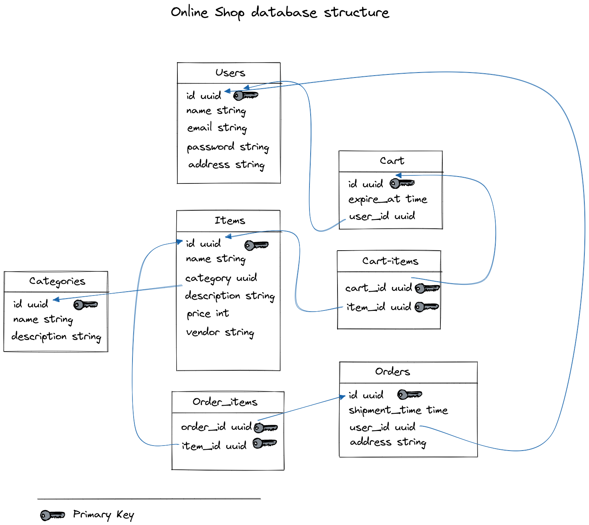

# База данных
Запускается командой `make start-db` из корня проекта

Логин, пароль, название базы устанавливаются в `makefile`. Таблицы инициализируются при запуске контейнера.

Инициализация находится в каталоге [`init_db`](./init_db/001.sql).

## Структура базы данных:

Схема реализована в редакторе [Excalidraw](https://excalidraw.com/)

[Файл со схемой](./DataBaseStructure.excalidraw)